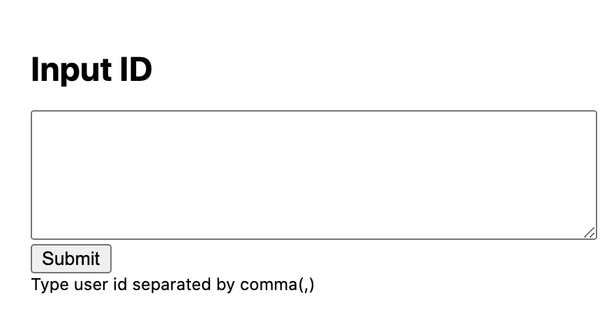
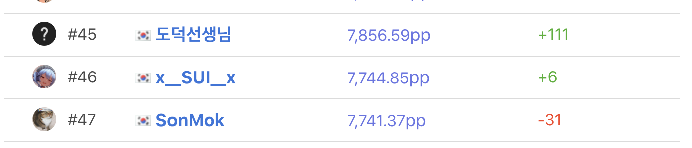
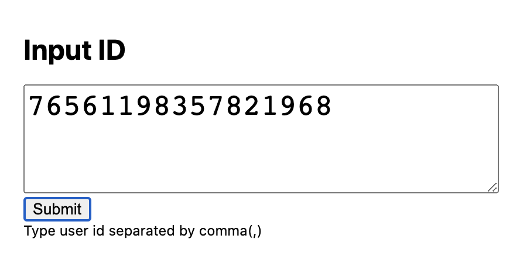
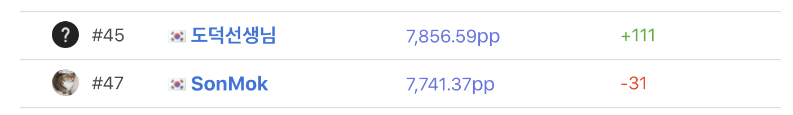

# SSR-Remover-ScoreSaber
Score Saber Ranker Remover

## Chrome에 적용 방법

1. [chrome://extensions](chrome://extensions)에 접속
2. 우측 상단의 **개발자 모드** ON
3. **압축해제된 확장 프로그램을 로드합니다**를 눌러 다운로드 한 파일들을 하나의 폴더에 넣어 선택

4. 빈 칸에 유저 아이디 입력 (여러 명 입력 시 쉼표로 구분)
5. Submit 버튼을 클릭

**실행 전**

**실행 중**

**실행 후**

이것만 있으면 나도 1등?